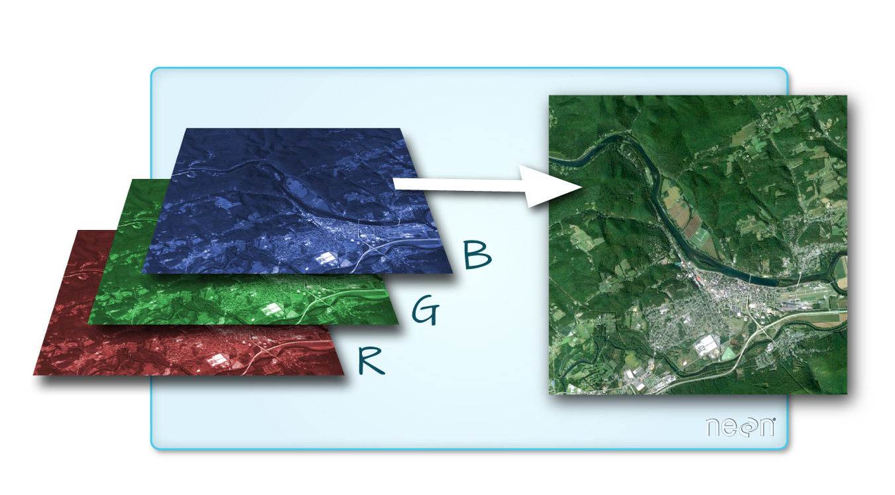

# 1 Introduction to geospatial concepts

## 1.1 Introduction to raster data

 
 
 
 

 
 
 
 

 
 
 
 

 
 
 
 

 
 
 
 

 
 
 
 

 
 
 
 

 
 
 
 

 
 
 
 

## 1.2 Introduction to vector data

 
 
 
 

### Which features are represented by which vector type?

 
 
 
 

## 1.3 Coordinate reference systems (CRS)

 
 
 
 

A PROJ4 string includes:    

* proj= the projection of the data
* zone= the zone of the data (this is specific to the Universal Transverse Mercator projection)
* datum= the datum use
* units= the units for the coordinates of the data
* ellps= the ellipsoid (how the earth’s roundness is calculated) for the data

`+proj=utm +zone=18 +datum=WGS84 +units=m +no_defs +ellps=WGS84 +towgs84=0,0,0`

